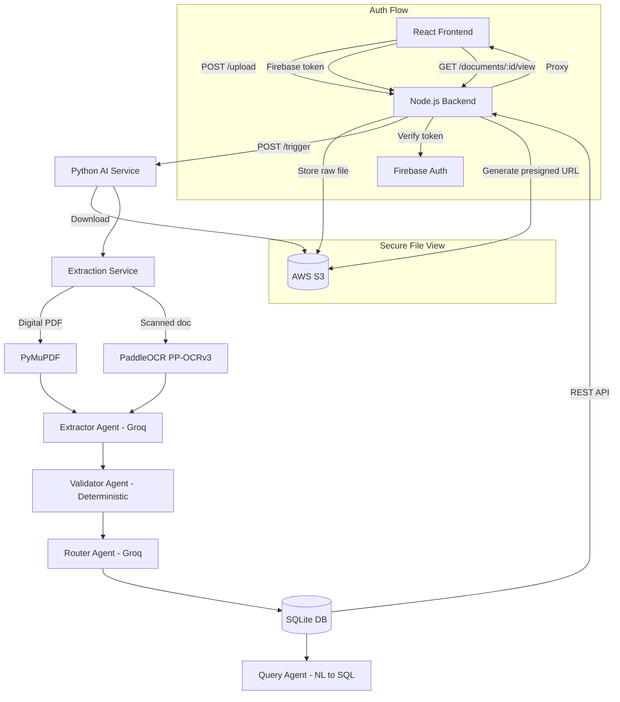

# TradeAI — Multi-Agent Trade Document Platform

A **production-quality, multi-agent AI system** for processing international trade documents. Built for the GoComet Full Stack AI Engineer Assignment.

---

## Live Demo

| Service | URL | Description |
|---------|-----|-------------|
| **Frontend** | [documentprocessorai-2.onrender.com](https://documentprocessorai-2.onrender.com) | React dashboard |
| **Backend API** | [documentprocessorai-1.onrender.com](https://documentprocessorai-1.onrender.com) | Node.js orchestration layer |
| **AI Service** | [aggarwalharshil02-ai-processor.hf.space](https://aggarwalharshil02-ai-processor.hf.space) | Python multi-agent pipeline |

**Sample credentials:** `sample@gmail.com` / `sampleaccount`

---

## System Architecture

```
Trade Document (PDF / Image)
        │
        ▼ POST /upload  →  AWS S3 (raw file storage)
        │
        ▼ POST /trigger →  Node.js backend
        │
┌───────▼──────────────────────────────────────────────┐
│              Python AI Service (FastAPI)               │
│                                                        │
│  ① EXTRACTOR AGENT   (Groq LLaMA-3.3 70B)            │
│     PyMuPDF (digital PDF) or PaddleOCR (scanned)      │
│     → 8 fields: { value, confidence, evidence }        │
│                                                        │
│  ② VALIDATOR AGENT   (Deterministic — zero LLM)       │
│     Loads customer_rules.json for customer_id          │
│     → per-field: match | mismatch | uncertain          │
│                                                        │
│  ③ ROUTER AGENT      (Groq LLaMA-3.3 70B)            │
│     → auto_approve | human_review | amendment_required │
│     → Human-readable reasoning + amendment draft       │
└───────────────────────────────────────────────────────┘
        │
        ▼  Persist
   SQLite DB (shipments, validation_results,
              agent_decisions, audit_logs)
        │
        ▼  Query Layer
   ④ QUERY AGENT  → NL → SQL → Grounded Answer
        │
        ▼  REST API (Node.js proxy)
   React Dashboard
```

---

## Three-Service Architecture

| Service | Stack | Port | Purpose |
|---------|-------|------|---------|
| **ai-service** | Python / FastAPI | 8000 | Multi-agent pipeline, SQLite |
| **server** | Node.js / Express | 5001 | Auth, S3 upload, API proxy |
| **client** | React / Vite / Tailwind | 5173 | Trade shipment dashboard |

---

## Agent Details

### ① Extractor Agent
- Runs hybrid OCR: PyMuPDF for digital PDFs, PaddleOCR PP-OCRv3 for scanned
- Sends raw text to Groq LLaMA-3.3 70B with a strict JSON prompt
- Extracts 8 trade fields, each with `{ value, confidence, source_evidence }`
- Returns `null` if uncertain — never hallucinate

### ② Validator Agent
- Zero LLM calls — fully deterministic, reproducible, auditable
- Loads per-customer rules from `customer_rules.json`
- Checks: consignee match, HS code prefix, incoterms, ports
- Three outcomes per field: `match` | `mismatch` | `uncertain`

### ③ Router Agent
- Applies decision rules: any mismatch → `amendment_required`, any uncertain → `human_review`, all match → `auto_approve`
- Uses Groq to generate human-readable reasoning text
- Produces amendment draft with specific discrepancies

### ④ Query Agent (NL→SQL)
- Takes natural language questions about shipment data
- Uses Groq to generate SQLite-compatible SQL
- Executes query, returns grounded answer from actual records
- Anti-hallucination: answer LLM only sees real query results

---

## Customer Rule Sets

| Customer | Incoterms | Loading | Discharge | HS Prefix | Threshold |
|----------|-----------|---------|-----------|-----------|-----------|
| `nike` | FOB, CIF | Shanghai | Los Angeles | 6404 | 0.75 |
| `adidas` | FOB, EXW | Hamburg | New York | 6404 | 0.75 |
| `zara` | DDP, DAP | Barcelona | Miami | 6204 | 0.70 |
| `apple` | DAP, DDP | Shenzhen | Los Angeles | 8471 | 0.85 |
| `maersk` | CFR, CIF, FOB | Any | Any | Any | 0.65 |
| `generic` | Any | Any | Any | Any | 0.60 |

---

## Local Setup

### Prerequisites
- Node.js v18+
- Python 3.10+
- AWS S3 bucket (private)
- Firebase project (Auth only)
- Groq API key

### Terminal 1 — Python AI Service
```bash
cd ai-service
python -m venv venv
source venv/bin/activate
pip install -r requirements.txt
uvicorn main:app --reload --port 8000
```

### Terminal 2 — Node.js Backend
```bash
cd server
npm install
node server.js
```

### Terminal 3 — React Frontend
```bash
cd client
npm install
npm run dev
```

App runs at: `http://localhost:5173`

---

## Environment Variables

### `ai-service/.env`
```
GROQ_API_KEY=...
AWS_ACCESS_KEY_ID=...
AWS_SECRET_ACCESS_KEY=...
AWS_REGION=...
AWS_BUCKET_NAME=...
```

### `server/.env`
```
AWS_ACCESS_KEY_ID=...
AWS_SECRET_ACCESS_KEY=...
AWS_REGION=...
AWS_BUCKET_NAME=...
FIREBASE_PROJECT_ID=...
FIREBASE_CLIENT_EMAIL=...
FIREBASE_PRIVATE_KEY="..."
GROQ_API_KEY=...
PYTHON_SERVICE_URL=http://localhost:8000
```

### `client/.env`
```
VITE_API_URL=http://localhost:5001
VITE_FIREBASE_API_KEY=...
VITE_FIREBASE_AUTH_DOMAIN=...
VITE_FIREBASE_PROJECT_ID=...
VITE_FIREBASE_STORAGE_BUCKET=...
VITE_FIREBASE_MESSAGING_SENDER_ID=...
VITE_FIREBASE_APP_ID=...
```

---

## Data Flow Diagram



---

## Key Design Decisions

- **SQLite over Firestore** for shipment data: zero infra, fully queryable, portable for demo
- **Firebase kept for Auth only**: login/logout UX preserved, all document ownership checks intact
- **S3 kept for raw files**: presigned URL viewer for original documents is fully functional
- **Zero-hallucination extraction**: LLM returns `null` for uncertain fields; never invents values
- **Deterministic validation**: Validator Agent makes zero LLM calls — reproducible and auditable
- **Grounded NL queries**: Query Agent LLM only sees actual SQLite rows — cannot fabricate answers
